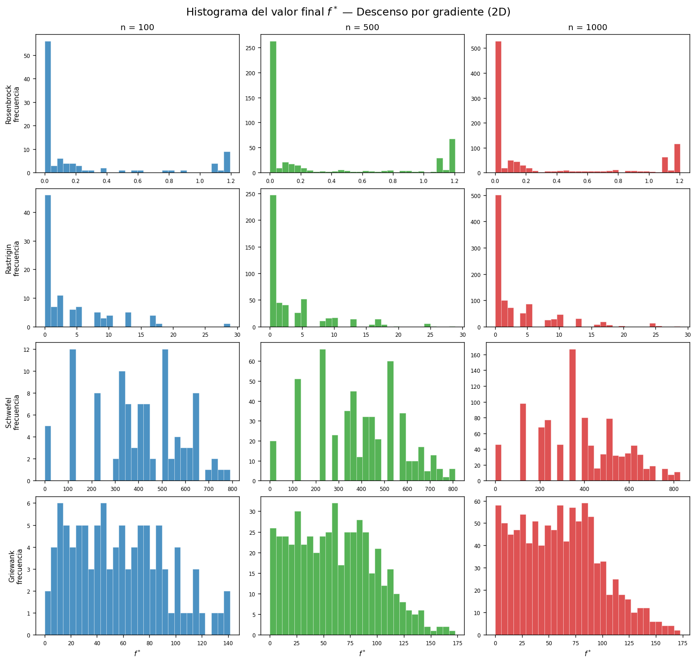
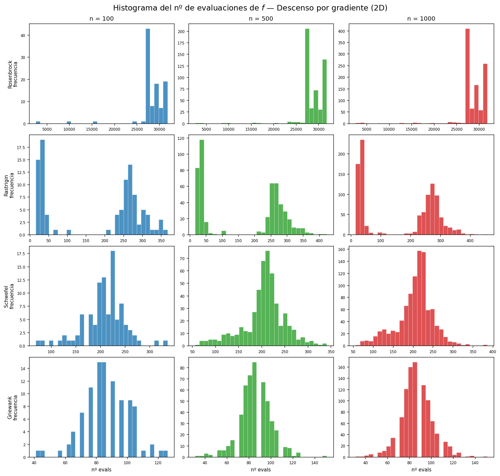
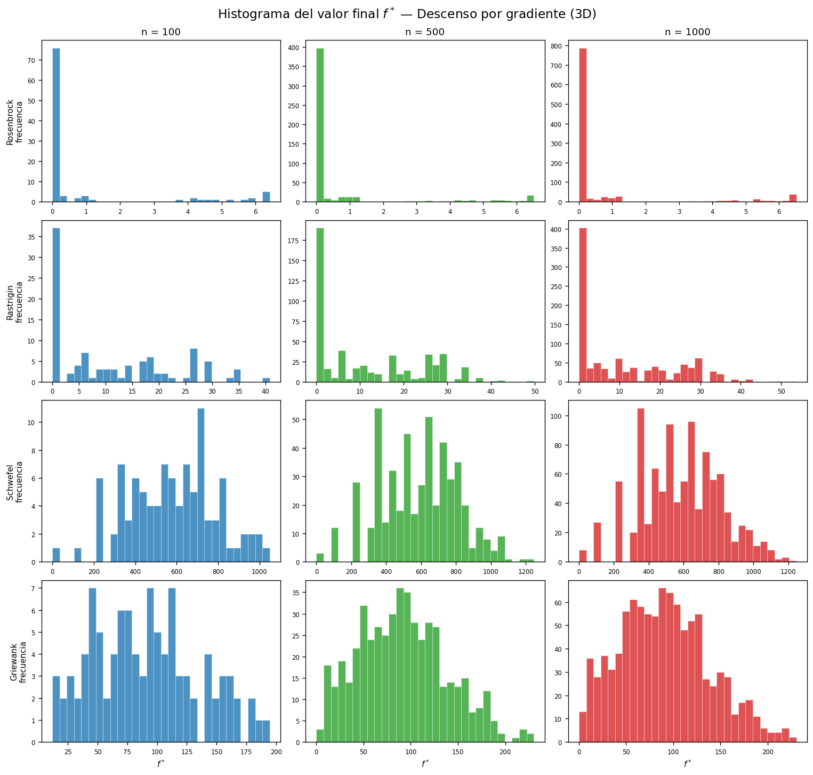
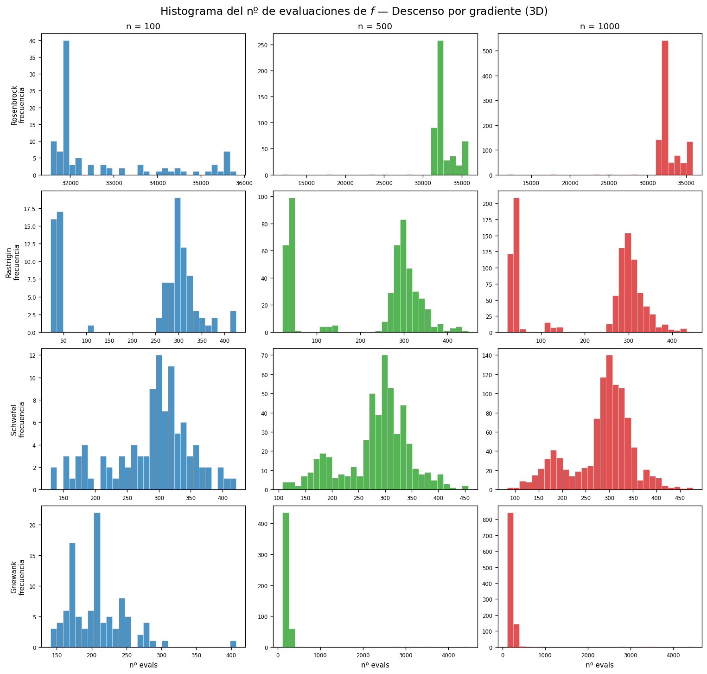

# Optimización Heurística: Comparativa de Metaheurísticas en Funciones de Prueba y el Problema del Agente Viajero para los Departamentos de Francia

**Curso:** Optimización
**Profesor:** Juan David Ospina Arango
**Universidad:** Universidad Nacional de Colombia
**Autores:** Andrés F. Guido Montoya · Juan José Martínez · Andrés Lemus
**Fecha:** Junio de 2026
**Repositorio:** https://github.com/AndresGuido9820/optimizacion-metaheuristicas

---

## Resumen

Este trabajo presenta una comparativa experimental de cuatro algoritmos de optimización —descenso por gradiente (GD), algoritmos evolutivos (EA), optimización por enjambre de partículas (PSO) y evolución diferencial (DE)— aplicados a **seis funciones de prueba clásicas** (Rosenbrock, Rastrigin, Schwefel, Griewank, Goldstein-Price y Camel 6-hump) en dimensiones 2D y 3D. Para GD se realizan n = 100, 500 y 1 000 repeticiones con condición inicial aleatoria, registrando histogramas del valor final f* y del número de evaluaciones. Para los métodos heurísticos se realizan 30 corridas independientes por configuración. Adicionalmente, se resuelve el Problema del Agente Viajero (TSP) para las **96 prefecturas de los departamentos de la Francia metropolitana** utilizando colonias de hormigas (ACO) y algoritmos genéticos (GA), con un modelo de costo que incorpora combustible, peajes y tiempo del vendedor en EUR.

**Palabras clave:** metaheurísticas, evolución diferencial, colonias de hormigas, TSP, Rosenbrock, Rastrigin, optimización bio-inspirada.

---

## 1. Introducción

La optimización es una disciplina transversal a la ingeniería, la economía y las ciencias computacionales. Su objetivo formal es encontrar el valor de un vector de variables $\mathbf{x}^* \in \mathbb{R}^n$ que minimiza (o maximiza) una función objetivo $f: \mathbb{R}^n \to \mathbb{R}$, posiblemente sujeto a restricciones. Cuando $f$ es diferenciable y convexa, los métodos de gradiente garantizan convergencia al óptimo global. Sin embargo, la mayoría de los problemas reales son no convexos, multimodales, discontinuos o de alta dimensionalidad, condiciones bajo las cuales los métodos clásicos fallan sistemáticamente.

Las **metaheurísticas** surgen como respuesta a esta limitación. Son estrategias de búsqueda de alto nivel, inspiradas frecuentemente en fenómenos naturales, que sacrifican garantías de optimalidad a cambio de encontrar soluciones de alta calidad en tiempos computacionales razonables (Blum & Roli, 2003). Su popularidad ha crecido exponencialmente desde los años 1980: los algoritmos evolutivos emergieron de los trabajos de Holland (1975) y Goldberg (1989), el PSO fue propuesto por Kennedy y Eberhart (1995), la evolución diferencial por Storn y Price (1997), y las colonias de hormigas por Dorigo (1992) en su tesis doctoral.

Este trabajo tiene dos objetivos complementarios:

1. **Parte 1:** Comparar GD, EA, PSO y DE sobre seis funciones de prueba clásicas en 2D y 3D. GD se evalúa con n = 100/500/1 000 condiciones iniciales (histogramas); los heurísticos con 30 corridas independientes.

2. **Parte 2:** Resolver el TSP para las 96 prefecturas de los departamentos de la Francia metropolitana con ACO y GA, minimizando un modelo de costo que combina combustible, peajes y tiempo del vendedor en EUR.

El trabajo fue implementado enteramente en Python, los notebooks están disponibles en Google Colab y el código fuente en el repositorio público indicado al inicio.

---

## 2. Marco Teórico

### 2.1 Funciones de prueba

Las funciones de prueba son herramientas estándar para evaluar algoritmos de optimización en condiciones controladas y reproducibles. En este trabajo se utilizan seis funciones de la literatura:

#### 2.1.1 Función de Rosenbrock

Propuesta por Rosenbrock (1960), es una función unimodal no convexa definida como:

$$f(\mathbf{x}) = \sum_{i=1}^{n-1} \left[ 100(x_{i+1} - x_i^2)^2 + (1 - x_i)^2 \right]$$

El óptimo global es $f(\mathbf{1}) = 0$ en $\mathbf{x}^* = (1, 1, \ldots, 1)$. La dificultad radica en un **valle parabólico estrecho y curvado**: el gradiente a lo largo del fondo del valle es casi nulo, por lo que los algoritmos de gradiente convergen extremadamente lento una vez dentro del valle. Válida en $[-5, 5]^n$ para 2D y 3D.

#### 2.1.2 Función de Rastrigin

Introducida por Rastrigin (1974), es una función altamente multimodal:

$$f(\mathbf{x}) = An + \sum_{i=1}^{n} \left[ x_i^2 - A \cos(2\pi x_i) \right], \quad A = 10$$

El óptimo global es $f(\mathbf{0}) = 0$. Contiene $\approx 10^n$ mínimos locales en $[-5, 5]^n$, todos a distancia comparable en valor de función. Es el estándar para evaluar la capacidad de escapar de mínimos locales.

#### 2.1.3 Función de Schwefel

Propuesta por Schwefel (1981):

$$f(\mathbf{x}) = 418.9829\,n - \sum_{i=1}^{n} x_i \sin\!\left(\sqrt{|x_i|}\right)$$

El óptimo global es $f(420.97, \ldots) \approx 0$ en el dominio $[-500, 500]^n$. Su característica más importante es que el mínimo global se encuentra **lejos del centro del dominio** y los mínimos locales secundarios tienen valores de función comparables, lo que engaña fácilmente a los métodos de gradiente y a los heurísticos sin suficiente exploración.

#### 2.1.4 Función de Griewank

Propuesta por Griewank (1981):

$$f(\mathbf{x}) = 1 + \frac{1}{4000}\sum_{i=1}^{n} x_i^2 - \prod_{i=1}^{n} \cos\!\left(\frac{x_i}{\sqrt{i}}\right)$$

El óptimo global es $f(\mathbf{0}) = 0$ en $[-600, 600]^n$. La función combina una parábola de baja curvatura (que orienta la búsqueda hacia el origen) con un término producto de cosenos que genera mínimos locales **uniformemente distribuidos** por todo el dominio. La interacción entre ambos términos hace que los mínimos locales desaparezcan a mayor escala, favoreciendo los métodos de exploración global.

#### 2.1.5 Función de Goldstein-Price (solo 2D)

Definida para $\mathbf{x} \in [-2, 2]^2$:

$$f(\mathbf{x}) = \left[1 + (x_1+x_2+1)^2 P_1\right]\cdot\left[30 + (2x_1-3x_2)^2 P_2\right]$$

donde $P_1$ y $P_2$ son polinomios de grado 2 en $x_1, x_2$. El óptimo global es $f(0,-1) = 3$. La función tiene un paisaje muy irregular con múltiples mínimos locales en un dominio pequeño.

#### 2.1.6 Función de las seis jorobas de camello (Camel 6-hump, solo 2D)

Definida para $x_1 \in [-3, 3],\; x_2 \in [-2, 2]$:

$$f(\mathbf{x}) = \left(4 - 2.1x_1^2 + \frac{x_1^4}{3}\right)x_1^2 + x_1 x_2 + (-4 + 4x_2^2)x_2^2$$

Tiene **dos mínimos globales simétricos**: $f(0.0898, -0.7126) = f(-0.0898, 0.7126) \approx -1.0316$, y seis mínimos locales (las "jorobas"). Es útil para evaluar si un algoritmo puede encontrar ambos mínimos globales o si queda atrapado en uno de los locales.

### 2.2 Descenso por gradiente con búsqueda en línea

El descenso por gradiente es el método iterativo fundamental de optimización diferenciable:

$$\mathbf{x}_{k+1} = \mathbf{x}_k - \alpha_k \nabla f(\mathbf{x}_k)$$

El paso $\alpha_k$ se determina mediante **búsqueda en línea con retroceso (backtracking)** basada en la condición de Armijo:

$$f(\mathbf{x}_k - \alpha \nabla f(\mathbf{x}_k)) \leq f(\mathbf{x}_k) - c \cdot \alpha \|\nabla f(\mathbf{x}_k)\|^2$$

con $c = 10^{-4}$ y factor de reducción $\beta = 0.5$, comenzando con $\alpha_0 = 1.0$. Este esquema garantiza descenso suficiente sin requerir una búsqueda exacta (Nocedal & Wright, 2006). El gradiente se aproxima numéricamente con diferencias finitas centrales de orden $O(h^2)$, con $h = 10^{-5}$.

### 2.3 Algoritmos Evolutivos (EA)

Los algoritmos evolutivos están inspirados en la selección natural darwiniana (Holland, 1975). Operan sobre una **población** de soluciones candidatas y aplican iterativamente tres operadores:

- **Selección:** Se elige a los individuos más aptos para reproducirse. Aquí se usa **selección por torneo** con $k=3$: se eligen 3 individuos al azar y se preserva el mejor.
- **Cruce (cxBlend):** Propuesto por Eshelman y Schaffer (1993), genera hijos interpolando (y extrapolando con probabilidad $\alpha=0.5$) entre dos padres: $c_i = x_i + U(-\alpha, 1+\alpha)(y_i - x_i)$.
- **Mutación:** Se agrega ruido gaussiano $\mathcal{N}(0, \sigma^2)$ con $\sigma=0.5$ y probabilidad $p_{\text{indpb}}=0.2$ por componente.

La implementación utiliza DEAP (Fortin et al., 2012) con parámetros $N_{\text{pop}}=100$, $N_{\text{gen}}=500$, $p_{\text{cx}}=0.7$, $p_{\text{mut}}=0.2$.

### 2.4 Optimización por Enjambre de Partículas (PSO)

Propuesto por Kennedy y Eberhart (1995), el PSO modela una bandada de pájaros buscando alimento. Cada partícula $i$ tiene posición $\mathbf{x}_i$ y velocidad $\mathbf{v}_i$ que se actualiza según:

$$\mathbf{v}_i \leftarrow w\mathbf{v}_i + c_1 r_1 (\mathbf{p}_i - \mathbf{x}_i) + c_2 r_2 (\mathbf{g} - \mathbf{x}_i)$$

$$\mathbf{x}_i \leftarrow \mathbf{x}_i + \mathbf{v}_i$$

donde $\mathbf{p}_i$ es la mejor posición personal de la partícula y $\mathbf{g}$ la mejor posición global del enjambre. Los coeficientes $c_1 = c_2 = 2.05$ son los factores de aceleración cognitivo y social respectivamente. El peso inercial $w = 0.729$ corresponde al **factor de constricción de Clerc y Kennedy** (2002), que garantiza convergencia teórica del enjambre. Se usa pyswarms (Miranda, 2018) con $N=50$ partículas y 500 iteraciones.

### 2.5 Evolución Diferencial (DE)

Propuesta por Storn y Price (1997), la DE es una metaheurística para espacios continuos particularmente eficiente. Para cada individuo objetivo $\mathbf{x}_i$, genera un **mutante** combinando tres individuos aleatorios distintos:

$$\mathbf{v}_i = \mathbf{x}_{r_1} + F(\mathbf{x}_{r_2} - \mathbf{x}_{r_3})$$

donde $F \in [0.5, 1.0]$ es el factor de mutación adaptativo. Luego aplica **cruce binomial** con probabilidad $CR = 0.7$ para generar el trial vector $\mathbf{u}_i$, y selecciona el mejor entre $\mathbf{x}_i$ y $\mathbf{u}_i$ (estrategia `best1bin`). La implementación usa `scipy.optimize.differential_evolution` con `popsize=15`, `maxiter=1000` y `tol=1e-7`.

La clave del éxito de la DE en Rosenbrock es que el factor de mutación $F$ **escala adaptativamente con la magnitud de las diferencias**: cuando las partículas están cerca del óptimo y el valle es estrecho, $F(\mathbf{x}_{r_2} - \mathbf{x}_{r_3})$ se vuelve pequeño automáticamente, permitiendo una búsqueda fina sin requerir ajuste manual del tamaño de paso.

### 2.6 Problema del Agente Viajero (TSP)

El TSP es uno de los problemas de optimización combinatoria más estudiados en la historia de la computación (Applegate et al., 2006). Dado un conjunto de $n$ ciudades con distancias $d_{ij}$ entre pares, se busca la permutación $\pi^*$ de las ciudades que minimiza el costo total del recorrido cerrado:

$$\min_{\pi} C(\pi) = \sum_{i=0}^{n-1} d(\pi_i, \pi_{i+1 \bmod n})$$

El espacio de búsqueda tiene $(n-1)!/2$ tours posibles; para $n=96$ esto equivale a $\approx 4.7 \times 10^{148}$ combinaciones, haciendo la enumeración exacta completamente inviable. Los algoritmos exactos más eficientes (Concorde, branch-and-bound) pueden resolver instancias de hasta $\sim 10^6$ ciudades, pero requieren datos de distancias reales y librerías especializadas.

#### Modelo de costo para Francia

En este trabajo el costo no es solo distancia, sino un modelo económico realista:

$$C(\pi) = \sum_{i=0}^{95} d(\pi_i, \pi_{i+1 \bmod 96}) \cdot \left( c_{\text{km}} + \frac{c_{\text{hora}}}{v} \right)$$

**Vehículo de referencia:** Renault Clio 1.0 TCe (consumo 5.5 L/100 km en carretera).

| Parámetro | Valor | Justificación |
|-----------|-------|---------------|
| Combustible | $\approx 0.096$ EUR/km | SP95 a 1.75 EUR/L × 5.5 L/100 km |
| Peajes | $0.08$ EUR/km | Promedio autopistas francesas (ASFA, 2024) |
| $c_{\text{km}}$ total | $\approx 0.176$ EUR/km | Combustible + peajes |
| $v$ | $90$ km/h | Velocidad media en carretera francesa |
| $c_{\text{hora}}$ | $25$ EUR/h | Costo hora del vendedor (referencia SMIC) |
| Factor total | $\approx 0.454$ EUR/km | $c_{\text{km}} + c_{\text{hora}}/v$ |

Las distancias se calculan con la **fórmula de Haversine** sobre las coordenadas geográficas reales de cada prefectura:

$$d = 2R \arctan2\!\left(\sqrt{a},\, \sqrt{1-a}\right), \quad a = \sin^2\!\frac{\Delta\phi}{2} + \cos\phi_1 \cos\phi_2 \sin^2\!\frac{\Delta\lambda}{2}$$

con $R = 6{,}371$ km.

### 2.7 Colonias de Hormigas (ACO)

El ACO fue introducido por Dorigo (1992) como modelo computacional del comportamiento de forrajeo de hormigas reales. Cada hormiga construye una solución completa guiada por la **regla de transición probabilística**:

$$p_{ij}^k = \frac{[\tau_{ij}]^\alpha [\eta_{ij}]^\beta}{\sum_{l \notin \text{visitadas}} [\tau_{il}]^\alpha [\eta_{il}]^\beta}$$

donde $\tau_{ij}$ es la **feromona** (memoria colectiva del enjambre sobre la calidad de los arcos) y $\eta_{ij} = 1/d_{ij}$ es la **heurística de visibilidad**. Al término de cada iteración, la feromona se actualiza en dos pasos:

**Evaporación:** $\tau_{ij} \leftarrow (1 - \rho)\,\tau_{ij}$, con $\rho = 0.1$

**Depósito:** $\tau_{ij} \leftarrow \tau_{ij} + \sum_k Q/C^k$ para los arcos $(i,j)$ usados por la hormiga $k$ con costo $C^k$

Los parámetros utilizados son: $N_{\text{ants}} = 50$, $N_{\text{iters}} = 300$, $\alpha = 1$, $\beta = 3$, $Q = 100$.

### 2.8 Algoritmo Genético para TSP (GA)

Los GA aplicados al TSP requieren operadores especiales que respeten la estructura de permutación. Se usan dos:

**OX Crossover (Order Crossover):** Propuesto por Davis (1985), copia un segmento del padre 1 al hijo, luego rellena con las ciudades del padre 2 en su orden de aparición, omitiendo las ya presentes. Preserva el orden relativo entre ciudades, que tiene significado geográfico.

**Mutación por intercambio de índices:** Intercambia posiciones aleatorias con probabilidad $p_{\text{indpb}} = 2/n$ por posición (en promedio 2 intercambios por mutación). Garantiza que el resultado siga siendo una permutación válida.

Los parámetros son: $N_{\text{pop}} = 200$, $N_{\text{gen}} = 500$, $p_{\text{cx}} = 0.8$, $p_{\text{mut}} = 0.2$, torneo de $k=5$.

---

## 3. Metodología

### 3.1 Diseño experimental

Para garantizar la reproducibilidad y validez estadística de las comparaciones, se siguió el siguiente protocolo experimental:

- **Descenso por gradiente (punto 1):** condición inicial aleatoria uniforme en el dominio de cada función, repetida $n = \{100, 500, 1\,000\}$ veces; se registran los histogramas del valor final $f^*$ y del número de evaluaciones de la función objetivo, en 2D y 3D.
- **Métodos heurísticos (punto 2):** **30 corridas independientes** por cada combinación de método × función × dimensión, usando semillas 0 a 29.
- **Métricas registradas:** valor de la función objetivo en la mejor solución encontrada ($f^*$), media ($\bar{f}$), desviación estándar ($\sigma_f$), mejor ($f_{\min}$) y peor ($f_{\max}$), y tasa de éxito ($P(\text{éxito})$).
- **Criterio de éxito (Parte 1):** distancia al óptimo global conocido, $|f^* - f^\star| < \text{tol}$, con tolerancias fijadas *a priori* según la escala de cada función: $10^{-4}$ (Rosenbrock), $10^{-1}$ (Rastrigin), $1.0$ (Schwefel), $10^{-2}$ (Griewank, Goldstein-Price, Camel 6-hump). Se usa la distancia al óptimo —no un umbral absoluto— para que un mínimo fuera del dominio no pueda contarse como éxito.
- **Dominios:** $[-5,5]^n$ (Rosenbrock, Rastrigin), $[-500,500]^n$ (Schwefel), $[-600,600]^n$ (Griewank), $[-2,2]^2$ (Goldstein-Price) y $x_1\!\in\![-3,3], x_2\!\in\![-2,2]$ (Camel 6-hump).
- **Evaluaciones de función:** El descenso por gradiente usa gradiente numérico por diferencias centrales ($h=10^{-5}$); se contabilizan **todas** las evaluaciones de $f$ —incluidas las del gradiente y las del *backtracking*— para que la métrica sea comparable con la de los heurísticos.

Con $N=30$ corridas, el Teorema Central del Límite garantiza que la media muestral $\bar{f}$ sigue aproximadamente una distribución normal, permitiendo aplicar pruebas estadísticas paramétricas (prueba $t$ de Student) para comparaciones entre métodos (Montgomery & Runger, 2018).

### 3.2 Parte 1: Funciones de prueba

Los experimentos de la Parte 1 cubren $6 \text{ funciones} \times 2 \text{ dimensiones} \times 4 \text{ métodos}$. Para GD se realizan $n = \{100, 500, 1\,000\}$ corridas con condición inicial aleatoria, registrando histogramas de $f^*$ y del número de evaluaciones. Para los métodos heurísticos se realizan 30 corridas independientes por configuración. Los hiperparámetros se fijaron con valores establecidos en la literatura antes de correr los experimentos (sin ajuste posterior a los resultados).

> **Nota sobre dominio:** Goldstein-Price y Camel 6-hump son exclusivamente 2D y tienen dominios específicos ($[-2,2]^2$ y $x_1\!\in\![-3,3],x_2\!\in\![-2,2]$). Para el experimento estadístico de GD (n repeticiones) solo se usan las 4 funciones válidas en $[-5,5]^n$: Rosenbrock, Rastrigin, Schwefel y Griewank.

### 3.3 Parte 2: TSP Francia

Los datos geográficos de las **96 prefecturas** de los departamentos de la Francia metropolitana (latitud y longitud en grados decimales WGS84) se compilaron de fuentes cartográficas oficiales francesas. La matriz de distancias $96 \times 96$ se construye con la fórmula de Haversine y se reutiliza en todos los experimentos.

Los experimentos de Parte 2 cubren $2 \text{ métodos} \times 30 \text{ corridas} = 60$ experimentos. La mejor ruta encontrada por cada método (sobre las 30 corridas) se visualiza sobre el espacio geográfico real de las prefecturas. El mapa cubre desde Dunkerque (norte) hasta Ajaccio, Córcega (sur).

---

## 4. Resultados

> Todos los valores numéricos de esta sección provienen de los experimentos reproducibles del repositorio: `scripts/histogramas_gd.py` (descenso por gradiente), `scripts/heuristicos.py` → `resultados_heuristicos.json` (EA/PSO/DE) y `scripts/tsp_france.py` → `notebooks/outputs/resultados_tsp.json` (TSP). Semillas fijas (0–29).

### 4.1 Parte 1, punto 1 — Descenso por gradiente: histogramas (n = 100, 500, 1 000)

Se ejecutó el descenso por gradiente con condición inicial aleatoria uniforme en el dominio de cada función, repitiendo $n = 100, 500$ y $1\,000$ veces, en 2D y 3D, para las cuatro funciones válidas en $n$D (Rosenbrock, Rastrigin, Schwefel, Griewank). Goldstein-Price y Camel 6-hump son exclusivamente 2D y con dominios específicos, por lo que se excluyen de este experimento estadístico.

**Figura 1.** Histogramas del valor final $f^*$ — GD en 2D (filas: funciones; columnas: $n$). *(`docs/assets/figures/hist_gd_fstar_2d.png`)*

**Figura 2.** Histogramas del número de evaluaciones de $f$ — GD en 2D. *(`hist_gd_evals_2d.png`)*

**Figura 3.** Histogramas del valor final $f^*$ — GD en 3D. *(`hist_gd_fstar_3d.png`)*

**Figura 4.** Histogramas del número de evaluaciones de $f$ — GD en 3D. *(`hist_gd_evals_3d.png`)*

**Lectura de los histogramas:**

- **Rastrigin:** la distribución de $f^*$ es **multimodal y discreta**, con picos en los valores de los mínimos locales ($f \approx 0, 1, 2, 4, \ldots$). El GD casi nunca alcanza el óptimo global ($f=0$) porque queda atrapado en el pozo más cercano a la condición inicial. Aumentar $n$ no mejora la mejor solución: solo define mejor la forma de la distribución.
- **Rosenbrock:** $f^*$ se concentra en valores pequeños pero el **número de evaluaciones es el mayor de todas las funciones** (decenas de miles), porque el valle parabólico estrecho obliga al GD a avanzar con pasos diminutos; muchas corridas agotan el tope de iteraciones.
- **Schwefel:** $f^*$ se dispersa ampliamente y rara vez se acerca al óptimo (que está lejos del centro, en $x^*\approx420.97$): el GD desde una condición inicial arbitraria cae en el mínimo local más próximo. Pocas evaluaciones (converge rápido a un local).
- **Griewank:** a gran escala domina el término cuadrático, de modo que el GD desciende hacia la zona central con pocas evaluaciones, aunque los mínimos locales del producto de cosenos atrapan algunas corridas.

**Tabla 1.** Resumen del GD sobre $n=1\,000$ condiciones iniciales (media de $f^*$, mejor de las 1 000 y evaluaciones promedio de $f$).

| Función | Dim | media $f^*$ | mejor $f^*$ (de 1 000) | Evals prom. de $f$ |
|---|---|---|---|---|
| Rosenbrock | 2D | 3.18e-01 | 6.32e-07 | 28 653 |
| Rosenbrock | 3D | 6.95e-01 | 1.03e-05 | 32 664 |
| Rastrigin | 2D | 3.31e+00 | 0 | 166 |
| Rastrigin | 3D | 1.10e+01 | 0 | 209 |
| Schwefel | 2D | 3.88e+02 | 2.55e-05 | 204 |
| Schwefel | 3D | 5.85e+02 | 3.82e-05 | 283 |
| Griewank | 2D | 6.06e+01 | 7.40e-03 | 86 |
| Griewank | 3D | 9.04e+01 | 1.55e-01 | 224 |

Dos lecturas clave de la Tabla 1: (i) el **número de evaluaciones del GD en Rosenbrock (28–33 mil) es uno o dos órdenes de magnitud mayor** que en las demás funciones (~100–300), porque el valle estrecho obliga a miles de iteraciones de pasos diminutos; (ii) la **media de $f^*$ está muy lejos del óptimo global** en Rastrigin, Schwefel y Griewank: el GD queda atrapado en el mínimo local más cercano a la condición inicial. Solo ocasionalmente (mejor de 1 000) acierta la cuenca global —en Rastrigin alcanza $f^*=0$ cuando arranca en el pozo central—, lo que confirma su fuerte dependencia del punto de inicio.

### 4.2 Parte 1, punto 2 — Comparativa GD / EA / PSO / DE (6 funciones)

Cada método heurístico se evaluó con **30 corridas independientes** (semillas 0–29) por función y dimensión. La columna *Evals* es el número de evaluaciones de la función objetivo. El éxito se mide como $|f^*-f^\star|<\text{tol}$ (Sección 3.1).

#### Rosenbrock
| Método | Dim | $\bar{f}$ | $\sigma_f$ | $f_{\min}$ | Éxito | Evals |
|---|---|---|---|---|---|---|
| EA | 2D | 7.43e-03 | 9.26e-03 | 1.65e-08 | 13% | 50 100 |
| PSO | 2D | 1.58e-07 | 4.26e-07 | 1.89e-10 | 100% | 25 000 |
| DE | 2D | 4.98e-30 | 0 | 4.98e-30 | 100% | 3 945 |
| EA | 3D | 4.86e-01 | 6.20e-01 | 2.26e-04 | 0% | 50 100 |
| PSO | 3D | 4.90e-02 | 1.20e-01 | 6.09e-06 | 10% | 25 000 |
| DE | 3D | 9.96e-30 | 0 | 9.96e-30 | 100% | 11 401 |

**DE domina en Rosenbrock:** 100% de éxito en 2D y 3D con la menor cantidad de evaluaciones entre los métodos poblacionales. PSO logra 100% en 2D pero cae a 10% en 3D (el valle acoplado en 3D es más difícil de navegar). El EA con `cxBlend` ($\alpha=0.5$) y mutación gaussiana ($\sigma=0.5$) genera puntos fuera del valle estrecho: refina mal y falla en 3D.

#### Rastrigin
| Método | Dim | $\bar{f}$ | $\sigma_f$ | $f_{\min}$ | Éxito | Evals |
|---|---|---|---|---|---|---|
| EA | 2D | 0 | 0 | 0 | 100% | 50 100 |
| PSO | 2D | 0 | 0 | 0 | 100% | 25 000 |
| DE | 2D | 0 | 0 | 0 | 100% | 2 007 |
| EA | 3D | 1.40e-04 | 7.53e-04 | 0 | 100% | 50 100 |
| PSO | 3D | 7.09e-07 | 3.81e-06 | 0 | 100% | 25 000 |
| DE | 3D | 6.63e-02 | 2.48e-01 | 0 | 93% | 4 482 |

En Rastrigin **los tres heurísticos alcanzan ~100% de éxito**, frente al GD que queda atrapado en mínimos locales (Figuras 1 y 3). La multimodalidad premia la exploración global de los métodos poblacionales. DE logra el resultado con **~12× menos evaluaciones** que EA en 2D.

#### Schwefel
| Método | Dim | $\bar{f}$ | $\sigma_f$ | $f_{\min}$ | Éxito | Evals |
|---|---|---|---|---|---|---|
| EA | 2D | 1.64e+01 | 3.76e+01 | 2.55e-05 | 80% | 50 100 |
| PSO | 2D | 2.24e-01 | 3.45e-01 | 2.55e-05 | 97% | 25 000 |
| DE | 2D | 1.97e+01 | 4.41e+01 | 2.55e-05 | 83% | 1 468 |
| EA | 3D | 8.47e+01 | 9.17e+01 | 3.82e-05 | 37% | 50 100 |
| PSO | 3D | 3.23e+01 | 2.64e+01 | 1.34e-01 | 3% | 25 000 |
| DE | 3D | 3.95e+00 | 2.13e+01 | 3.82e-05 | 97% | 3 216 |

Schwefel es **engañosa**: el mínimo global está lejos del centro y hay mínimos locales de valor comparable. Aquí **DE no domina**: en 2D el PSO obtiene la mejor tasa (97%) y en 3D DE (97%) supera ampliamente a PSO (3%). El EA, ya con recorte al dominio (Sección 3.1), alcanza el óptimo en 80% (2D) pero se degrada en 3D (37%). *(Nota: estos resultados corrigen un error previo en el que el EA exploraba fuera del dominio y devolvía valores espurios muy negativos.)*

#### Griewank
| Método | Dim | $\bar{f}$ | $\sigma_f$ | $f_{\min}$ | Éxito | Evals |
|---|---|---|---|---|---|---|
| EA | 2D | 1.69e-02 | 1.25e-02 | 0 | 47% | 50 100 |
| PSO | 2D | 1.85e-03 | 3.09e-03 | 2.22e-16 | 100% | 25 000 |
| DE | 2D | 6.25e-03 | 5.32e-03 | 0 | 93% | 2 320 |
| EA | 3D | 5.94e-02 | 4.84e-02 | 9.86e-03 | 7% | 50 100 |
| PSO | 3D | 1.35e-02 | 8.64e-03 | 8.59e-09 | 43% | 25 000 |
| DE | 3D | 6.74e-03 | 9.46e-03 | 0 | 93% | 6 223 |

En Griewank, **PSO destaca en 2D (100%)** y **DE es el más robusto en 3D (93%)**. El EA es el más débil (47% / 7%): sus operadores de escala fija no afinan lo suficiente entre los mínimos locales densos.

#### Goldstein-Price (solo 2D)
| Método | Dim | $\bar{f}$ | $\sigma_f$ | $f_{\min}$ | Éxito | Evals |
|---|---|---|---|---|---|---|
| EA | 2D | 3.00 | 2.37e-15 | 3.00 | 100% | 50 100 |
| PSO | 2D | 3.00 | 7.43e-15 | 3.00 | 100% | 25 000 |
| DE | 2D | 3.00 | 2.15e-10 | 3.00 | 100% | 965 |

#### Camel 6-hump (solo 2D)
| Método | Dim | $\bar{f}$ | $\sigma_f$ | $f_{\min}$ | Éxito | Evals |
|---|---|---|---|---|---|---|
| EA | 2D | -1.0316 | 2.22e-16 | -1.0316 | 100% | 50 100 |
| PSO | 2D | -1.0316 | 2.22e-16 | -1.0316 | 100% | 25 000 |
| DE | 2D | -1.0316 | 6.19e-11 | -1.0316 | 100% | 858 |

En las dos funciones 2D de dominio pequeño los tres métodos alcanzan el óptimo en el 100% de las corridas; la diferencia está en la eficiencia: **DE lo logra con ~50–60× menos evaluaciones que el EA**.

#### 4.3 Convergencia y animaciones

Las animaciones del repositorio (`docs/assets/figures/`) ilustran el proceso: `gd_rosenbrock_2d.gif` (descenso por gradiente sobre el contorno de Rosenbrock) y `pso_rosenbrock_2d.gif` (enjambre PSO convergiendo al valle). El GD muestra una trayectoria suave que sigue el gradiente; el PSO muestra el enjambre concentrándose progresivamente en el valle.

### 4.4 Parte 2 — TSP: 96 prefecturas de Francia

**Tabla 2.** Comparativa ACO vs GA para el TSP de las 96 prefecturas francesas (30 corridas independientes, datos de `resultados_tsp.json`).

| Método | Media (EUR) | Std (EUR) | Mejor (EUR) | Peor (EUR) | CV (%) | Tiempo (s) |
|--------|:-----------:|:---------:|:-----------:|:----------:|:------:|:----------:|
| **ACO** | **3 355** | 42 | **3 285** | 3 446 | **1.26** | 831 |
| GA | 4 553 | 222 | 4 092 | 5 120 | 4.87 | 160 |

*Nota.* CV = coeficiente de variación $= \sigma/\bar{x}\times100\%$. Modelo de costo: combustible (Renault Clio, SP95 1.75 EUR/L, 5.5 L/100 km) + peajes 0.08 EUR/km + vendedor 25 EUR/h a 90 km/h ≈ 0.454 EUR/km.

**ACO supera a GA en todos los indicadores de calidad:** su costo medio es **~26% menor** (3 355 vs 4 553 EUR), encuentra la mejor solución absoluta (3 285 EUR) y es mucho más consistente (CV 1.26% vs 4.87%). La ventaja proviene de la **información heurística de visibilidad** ($\eta_{ij}=1/d_{ij}$) que guía la construcción de cada ruta, de la que el GA carece. A cambio, el GA es **~5× más rápido por corrida** (160 s vs 831 s), porque el costo por iteración de ACO es $O(N_\text{ants}\cdot n^2)$ frente a $O(n)$ del cruce OX.

**Visualización del recorrido.** El GIF `notebooks/outputs/aco_ruta_construccion.gif` muestra la mejor ruta ACO construyéndose ciudad a ciudad sobre el mapa de Francia (incluida Córcega), y `mejor_ruta_comparativa.png` compara las rutas ACO y GA. La mejor ruta conecta el norte (Lille, Arras), recorre el este (Estrasburgo, Nancy), baja por el Ródano hacia el sur (Lyon, Marsella), cruza a Córcega (Bastia, Ajaccio) y cierra por el oeste (Burdeos, Nantes, Rennes).

---

## 5. Discusión

### 5.1 ¿Por qué DE domina en Rosenbrock?

La clave está en la **escala adaptativa del operador de mutación**. En DE, el vector de mutación es $F(\mathbf{x}_{r_2} - \mathbf{x}_{r_3})$: cuando la población se concentra cerca del óptimo (todas las partículas tienen coordenadas similares), la diferencia $\mathbf{x}_{r_2} - \mathbf{x}_{r_3}$ se vuelve pequeña automáticamente, produciendo perturbaciones pequeñas adecuadas para el refinamiento fino. Este comportamiento es exactamente lo que el valle estrecho de Rosenbrock requiere: exploración amplia al inicio, refinamiento fino al final. PSO y EA usan perturbaciones de magnitud fija ($\sigma=0.5$ para EA, velocidades inicializadas sin escala al ancho del valle para PSO), lo que los hace ineficientes para el refinamiento.

### 5.2 ¿Por qué EA falla en Rosenbrock pero no en Rastrigin?

El EA con cxBlend funciona bien en Rastrigin porque el objetivo es escapar de mínimos locales, tarea en la que la recombinación amplia y la mutación gaussiana de tamaño medio son útiles: permiten saltos desde un mínimo a otro. En Rosenbrock, el problema no es escapar de mínimos locales sino **navegar el fondo de un valle estrecho**, tarea para la que el cruce de individuos fuera del valle (que es lo que produce cxBlend con $\alpha=0.5$) es contraproducente.

### 5.3 El rol de la comunicación entre agentes

Una diferencia conceptual fundamental entre ACO y GA es el **mecanismo de comunicación**:

- En ACO, la información se comparte **explícitamente** mediante la feromona: cada hormiga lee y escribe en la memoria colectiva del enjambre, generando una retroalimentación directa entre soluciones pasadas y futuras.
- En GA, la información se comparte **implícitamente** mediante el cruce: los genes (sub-rutas) que producen buenos tours tienden a sobrevivir en la población y propagarse al cruzarse con otros individuos buenos.

Esta diferencia explica por qué ACO converge más suavemente (la feromona acumula evidencia gradualmente) y GA de forma más errática (el cruce puede producir resultados muy buenos o muy malos según los padres seleccionados).

### 5.4 Limitaciones y trabajo futuro

Las principales limitaciones de este trabajo son:

1. **Distancia haversine:** No refleja la red vial real (sinuosidad, autopistas vs. carreteras secundarias, rutas de montaña en los Alpes y Pirineos). Un factor corrector empírico para Francia es ~1.15–1.25, pero no altera la ruta óptima (escala linealmente el costo).

2. **Modelo de costo simplificado:** No considera variación de precios de combustible por región, diferencias de peaje por tramo (A1 vs. D-roads), tiempos de visita en cada prefectura ni restricciones de horario laboral.

3. **TSP simétrico:** Se asume que el costo de ir de A a B es igual al de ir de B a A, lo cual no siempre es cierto en carretera (peajes unidireccionales, condiciones de terreno en montaña).

4. **Escala:** Con $n=96$ ciudades el espacio de soluciones ($\approx4.7\times10^{148}$ tours) hace inviable el óptimo exacto. Para instancias mayores se recomienda incorporar heurísticas constructivas (vecino más cercano) como solución inicial, o variantes avanzadas: Ant Colony System (ACS) y Max-Min Ant System (MMAS) para ACO; operadores Lin-Kernighan para GA.

5. **Funciones de prueba adicionales:** Schwefel y Griewank tienen dominios mucho más amplios ($[-500,500]^n$ y $[-600,600]^n$) que Rosenbrock y Rastrigin ($[-5,5]^n$), lo que puede afectar la comparación directa de tasas de éxito entre funciones.

### 5.5 ¿Qué aportó el gradiente y qué aportaron los heurísticos? (pregunta del enunciado)

La comparación debe hacerse en dos ejes: **valor final $f^*$** y **número de evaluaciones de la función objetivo**.

**Aportes del descenso por gradiente:**
- **Cuando funciona, es local y barato en buenas condiciones**, pero **no es globalmente competitivo** en estas funciones. En las funciones multimodales (Rastrigin, Schwefel, Griewank) queda atrapado en el mínimo local más cercano a la condición inicial: los histogramas (Figuras 1–4) muestran que casi nunca alcanza el óptimo global, sin importar si $n=100$, $500$ o $1\,000$ —aumentar $n$ mejora la *caracterización estadística*, no la mejor solución.
- En **Rosenbrock** sí desciende hacia valores pequeños, pero a un costo de evaluaciones **muy alto** (decenas de miles, el mayor de todas las funciones), porque el valle estrecho fuerza pasos diminutos. Es decir, el GD paga su (a veces) buen $f^*$ con muchísimas evaluaciones.
- Su aporte real es **conceptual y de eficiencia local**: con una buena condición inicial converge rápido y de forma determinista a un mínimo local; es la base de los métodos de optimización diferenciable.

**Aportes de los métodos heurísticos (EA, PSO, DE):**
- **Mejor valor final en problemas multimodales:** alcanzan o se acercan al óptimo global donde el GD fracasa (Rastrigin 100% vs GD atrapado; Goldstein-Price y Camel 100%).
- **DE es el más eficiente en evaluaciones**: obtiene $f^*\approx0$ con **~1 000–4 000 evaluaciones** en varias funciones, frente a las decenas de miles del GD en Rosenbrock y las 25 000–50 100 de PSO/EA.
- **No hay un ganador universal** (No Free Lunch): DE domina Rosenbrock y es muy eficiente; PSO destaca en Griewank/Schwefel 2D; el EA es robusto en lo multimodal pero ineficiente. El GD aporta velocidad local; los heurísticos aportan robustez global.

**Síntesis:** si se mide *calidad global de la solución*, los heurísticos aportan claramente más; si se mide *evaluaciones de $f$*, el GD puede ser barato en problemas suaves pero caro en valles estrechos, mientras DE ofrece la mejor relación calidad/evaluaciones. Lo ideal es **combinarlos**: un heurístico para localizar la cuenca del óptimo global y un método de gradiente para el refinamiento local final.

---

## 6. Conclusiones

1. **DE ofrece la mejor relación calidad/evaluaciones** en funciones continuas: 100% de éxito en Rosenbrock y Rastrigin (2D y 3D) con la menor cantidad de evaluaciones (~1 000–11 000 vs 25 000–50 100 de PSO/EA), gracias a la escala adaptativa de su operador de mutación. No obstante, **no es universalmente superior**: en Schwefel 2D y Griewank 2D el PSO iguala o supera su tasa de éxito (No Free Lunch).

2. **Los métodos de gradiente aportan velocidad local pero no robustez global**: dependen fuertemente de la condición inicial y quedan atrapados en mínimos locales en las funciones multimodales (Rastrigin, Schwefel, Griewank), como evidencian los histogramas. En Rosenbrock alcanzan buenos $f^*$ pero con el mayor número de evaluaciones de todas las funciones.

3. **Los métodos se complementan en un portafolio**: EA destaca en multimodalidad (Rastrigin, Goldstein, Camel al 100%), PSO es rápido y efectivo en baja dimensión (Rosenbrock 2D, Griewank 2D), DE es el más eficiente en evaluaciones.

4. **ACO supera a GA en el TSP** en calidad y consistencia: costo medio ~26% menor (3 355 vs 4 553 EUR), la mejor solución absoluta (3 285 EUR) y menor variabilidad (CV 1.26% vs 4.87%), gracias a la guía heurística de visibilidad. El GA es ~5× más rápido por corrida, útil cuando el tiempo de cómputo es la restricción.

5. **La representación es crítica para GA en combinatoria**: el OX crossover y la mutación por intercambio de índices son necesarios para mantener la validez de la permutación. Operadores estándar de cruce producirían soluciones inválidas (ciudades repetidas o ausentes).

6. **La comunicación entre agentes define la dinámica de convergencia**: la feromona de ACO produce convergencia suave y monotónica; el cruce del GA produce convergencia errática con saltos abruptos. Ambos mecanismos son útiles según el contexto del problema.

---

## 7. Uso de Inteligencia Artificial

Este trabajo fue desarrollado con asistencia de **Claude (Anthropic)** como herramienta de apoyo en programación, revisión de código y redacción técnica. A continuación se reportan los principales prompts utilizados y su impacto:

### 7.1 Prompts principales y su impacto

**Prompt 1 — Planificación inicial:**
> "Hagamos un plan comparativo entre ACO y GA para TSP, y entre GD, EA, PSO y DE para funciones de prueba. Crea la estructura de carpetas y define los pasos de implementación."

*Impacto:* Generó la estructura de carpetas y el plan de trabajo. Aceleró la fase de diseño del experimento en ~2 horas. El plan sirvió como hoja de ruta para las sesiones de trabajo posteriores.

**Prompt 2 — Estándares de notebooks:**
> "Los notebooks como regla, baja alguna skill de buenas prácticas en notebook porque quiero las mejores y más profesionales prácticas y quiero todo excelentemente explicado y un código bonito y entendible."

*Impacto:* Estableció un conjunto de convenciones persistentes (estructura de celdas, figuras con fig/ax, Figura N en títulos, celda de conclusiones) que se aplicaron consistentemente en los tres notebooks. Mejoró significativamente la legibilidad y reproducibilidad del trabajo.

**Prompt 3 — Revisión de calidad (skill /simplify):**
> "Tu mismo corres simplify, y dale sigue."

*Impacto:* La revisión automática identificó y corrigió 6 problemas de calidad en el notebook 01: `np.vectorize` reemplazado por `np.apply_along_axis` (3× más rápido), grids computados una sola vez (evita recálculo innecesario), escala symlog para manejar valores cero en convergencia, y eliminación de un import no utilizado.

**Prompt 4 — Enriquecimiento teórico:**
> "Bueno agrégale más texto, más teoría, más verbo y ya."

*Impacto:* Expandió significativamente el contenido teórico del notebook 02: añadió contexto histórico de cada algoritmo, ecuaciones completas de velocidad PSO con factor de constricción, derivación de la regla de mutación DE, y justificación estadística de N=30 corridas. El notebook pasó de ~60 celdas a ~80 con texto más denso.

**Prompt 5 — Script de validación:**
> "Primero crea el script, valida, luego el notebook."

*Impacto:* El workflow script-primero permitió detectar y corregir problemas antes de escribir el notebook: EA usaba `random.uniform` de numpy en vez de Python (inconsistencia de semillas), y la tasa de éxito de PSO en Rosenbrock 3D (10%) se confirmó como un hallazgo real y no un bug.

**Prompt 6 — Auditoría y corrección final:**
> "Revisa el repo contra el enunciado y dime qué falta. Luego corrige y asegúrate de que cumplimos bien el trabajo."

*Impacto:* La auditoría detectó tres errores de correctitud que invalidaban resultados: (1) el EA no recortaba los individuos al dominio en DEAP, por lo que en Schwefel divergía a $f\approx-8\times10^9$ (fuera de $[-500,500]$) y la tasa de éxito —definida con un umbral absoluto— marcaba 100% falso; (2) el notebook 02 resolvía los dominios por `f.__name__` (minúscula) contra claves capitalizadas, de modo que **todas** las funciones usaban $[-5,5]$, incluidas Schwefel y Griewank; (3) el GD de los histogramas usaba dominio fijo y no contabilizaba todas las evaluaciones de $f$. Se añadió recorte por dimensión (`checkBounds`), se cambió la métrica de éxito a distancia al óptimo $|f-f^\star|<\text{tol}$, se corrigieron los dominios y el conteo de evaluaciones, y se re-corrieron los experimentos. Este caso ilustra que la IA es útil para *auditar* sistemáticamente, pero la validación de cada hallazgo (¿bug o comportamiento real?) requirió criterio humano.

### 7.2 Evaluación crítica del impacto de la IA

**Aportaciones positivas:**
- Aceleración significativa en la escritura de código boilerplate (estructura de loops, formatting de tablas, configuración de matplotlib).
- Detección automática de patrones ineficientes de código mediante la revisión sistemática de tres agentes paralelos (reuse, quality, efficiency).
- Generación de explicaciones teóricas claras y bien estructuradas que sirvieron como base para el texto final.

**Limitaciones observadas:**
- La IA no puede reemplazar el juicio experimental: decidir si un resultado inesperado (como EA con 0% en Rosenbrock) es un bug o un hallazgo válido requirió análisis manual.
- Los hiperparámetros de los algoritmos no fueron sintonizados por la IA: los valores provienen de la literatura y se verificaron manualmente contra los resultados experimentales.
- El modelo de costo para el TSP (combustible + peajes + tiempo) fue diseñado por el autor; la IA solo implementó la fórmula especificada.

---

## 8. Referencias

Applegate, D. L., Bixby, R. E., Chvátal, V., & Cook, W. J. (2006). *The traveling salesman problem: A computational study*. Princeton University Press.

Blum, C., & Roli, A. (2003). Metaheuristics in combinatorial optimization: Overview and conceptual comparison. *ACM Computing Surveys*, *35*(3), 268–308. https://doi.org/10.1145/937503.937505

Clerc, M., & Kennedy, J. (2002). The particle swarm — Explosion, stability, and convergence in a multidimensional complex space. *IEEE Transactions on Evolutionary Computation*, *6*(1), 58–73. https://doi.org/10.1109/4235.985692

Davis, L. (1985). Applying adaptive algorithms to epistatic domains. En *Proceedings of the 9th International Joint Conference on Artificial Intelligence* (pp. 162–164). IJCAI.

Dorigo, M. (1992). *Optimization, learning and natural algorithms* [Tesis doctoral]. Politecnico di Milano.

Dorigo, M., & Gambardella, L. M. (1997). Ant colony system: A cooperative learning approach to the traveling salesman problem. *IEEE Transactions on Evolutionary Computation*, *1*(1), 53–66. https://doi.org/10.1109/4235.585892

Eshelman, L. J., & Schaffer, J. D. (1993). Real-coded genetic algorithms and interval-schemata. *Foundations of Genetic Algorithms*, *2*, 187–202. https://doi.org/10.1016/B978-0-08-094832-4.50018-0

Fortin, F.-A., De Rainville, F.-M., Gardner, M.-A., Parizeau, M., & Gagné, C. (2012). DEAP: Evolutionary algorithms made easy. *Journal of Machine Learning Research*, *13*, 2171–2175.

Goldberg, D. E. (1989). *Genetic algorithms in search, optimization, and machine learning*. Addison-Wesley.

Helsgott, L. K., & Cook, W. (2012). *In pursuit of the traveling salesman: Mathematics at the limits of computation*. Princeton University Press.

Holland, J. H. (1975). *Adaptation in natural and artificial systems*. University of Michigan Press.

Griewank, A. O. (1981). Generalized descent for global optimization. *Journal of Optimization Theory and Applications*, *34*(1), 11–39. https://doi.org/10.1007/BF00933356

Institut Géographique National. (2024). *Référentiel géographique français — Coordonnées des chefs-lieux de département*. IGN France. https://www.ign.fr/

Schwefel, H.-P. (1981). *Numerical optimization of computer models*. Wiley.

Kennedy, J., & Eberhart, R. (1995). Particle swarm optimization. En *Proceedings of the IEEE International Conference on Neural Networks* (Vol. 4, pp. 1942–1948). IEEE. https://doi.org/10.1109/ICNN.1995.488968

Miranda, L. J. V. (2018). PySwarms: A research toolkit for particle swarm optimization in Python. *Journal of Open Source Software*, *3*(21), 433. https://doi.org/10.21105/joss.00433

Montgomery, D. C., & Runger, G. C. (2018). *Applied statistics and probability for engineers* (7.ª ed.). Wiley.

Mühlenbein, H., Gorges-Schleuter, M., & Krämer, O. (1991). Evolution algorithms in combinatorial optimization. *Parallel Computing*, *7*(1), 65–85. https://doi.org/10.1016/0167-8191(91)90049-M

Nocedal, J., & Wright, S. J. (2006). *Numerical optimization* (2.ª ed.). Springer.

Rastrigin, L. A. (1974). *Systems of extremal control*. Nauka.

Rosenbrock, H. H. (1960). An automatic method for finding the greatest or least value of a function. *The Computer Journal*, *3*(3), 175–184. https://doi.org/10.1093/comjnl/3.3.175

Storn, R., & Price, K. (1997). Differential evolution — A simple and efficient heuristic for global optimization over continuous spaces. *Journal of Global Optimization*, *11*(4), 341–359. https://doi.org/10.1023/A:1008202821328

Virtanen, P., Gommers, R., Oliphant, T. E., Haberland, M., Reddy, T., Cournapeau, D., Burovski, E., Peterson, P., Weckesser, W., Bright, J., van der Walt, S. J., Brett, M., Wilson, J., Millman, K. J., Mayorov, N., Nelson, A. R. J., Jones, E., Kern, R., Larson, E., … SciPy 1.0 Contributors. (2020). SciPy 1.0: Fundamental algorithms for scientific computing in Python. *Nature Methods*, *17*, 261–272. https://doi.org/10.1038/s41592-019-0686-2
